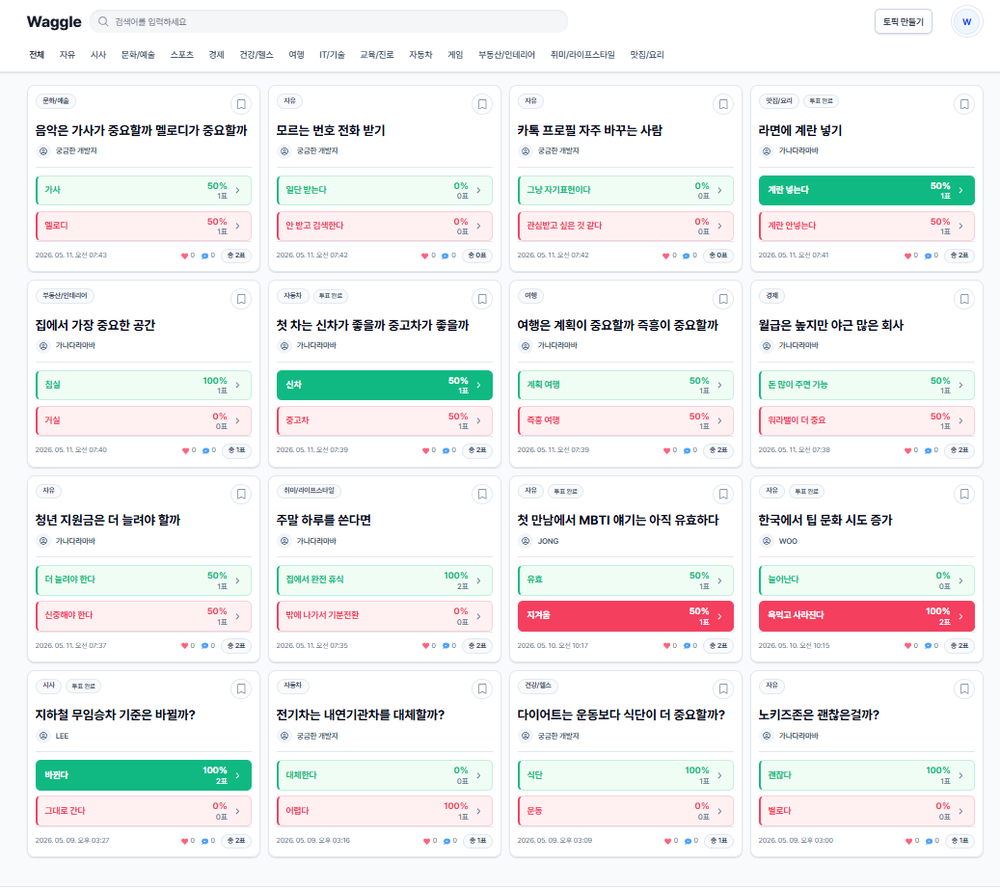
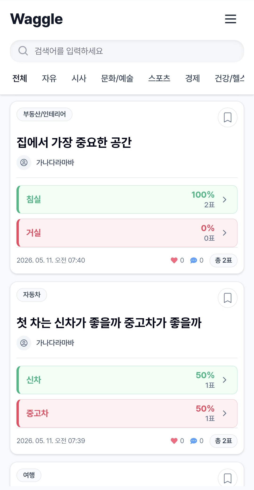
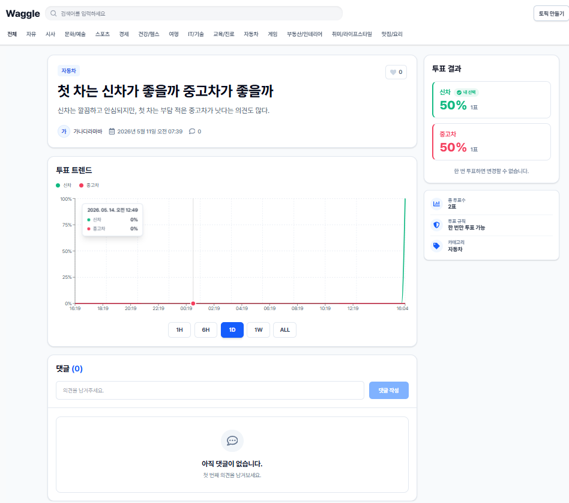
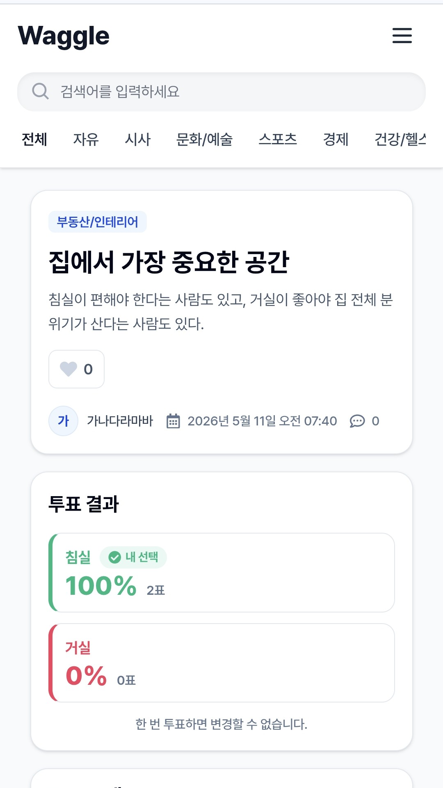
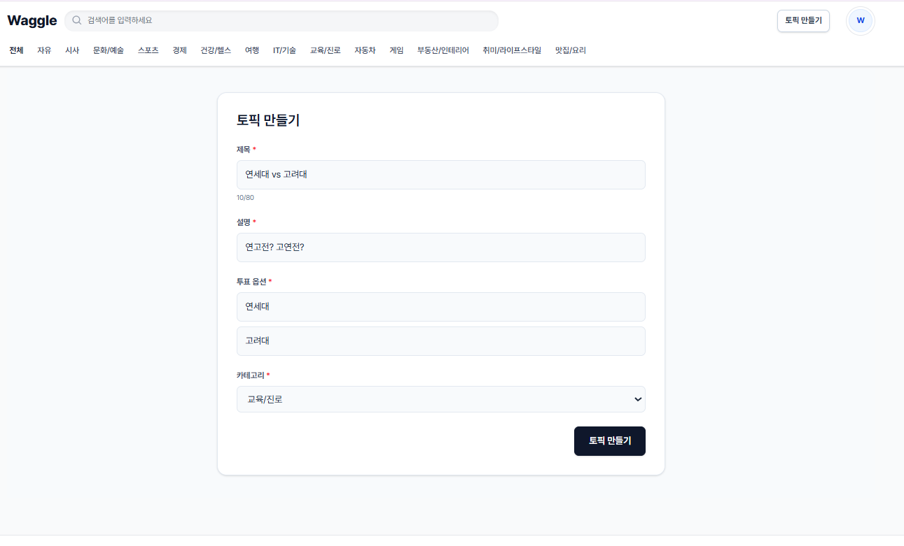
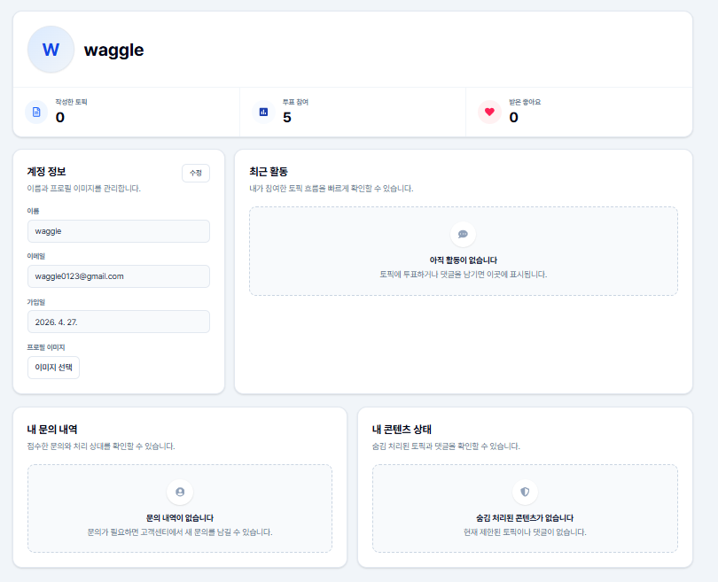
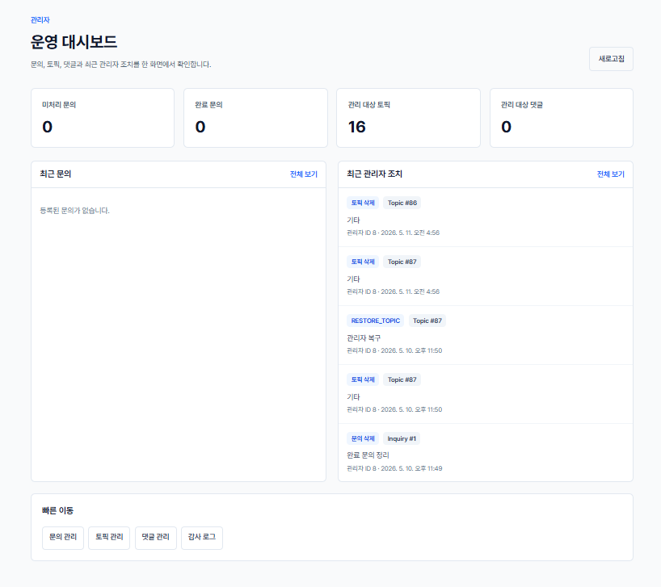
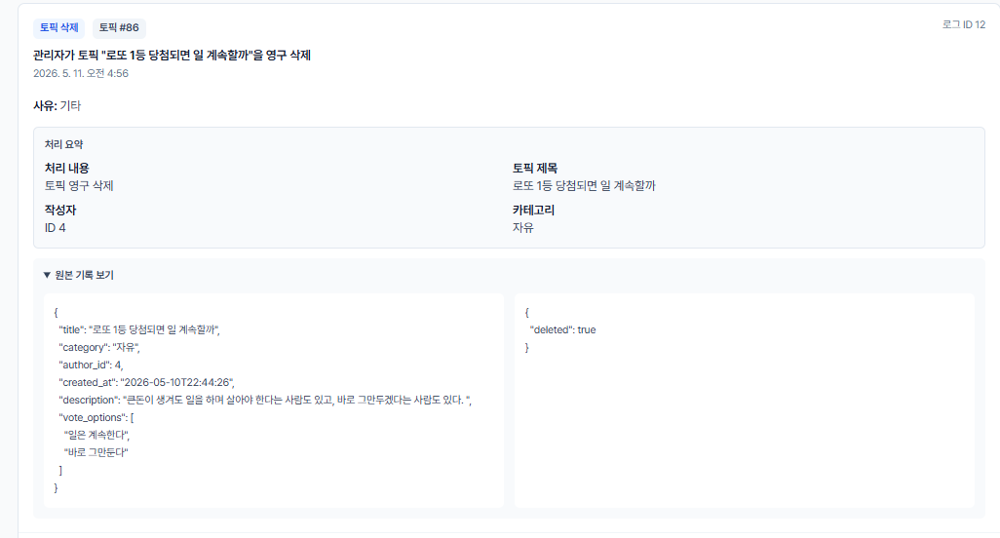
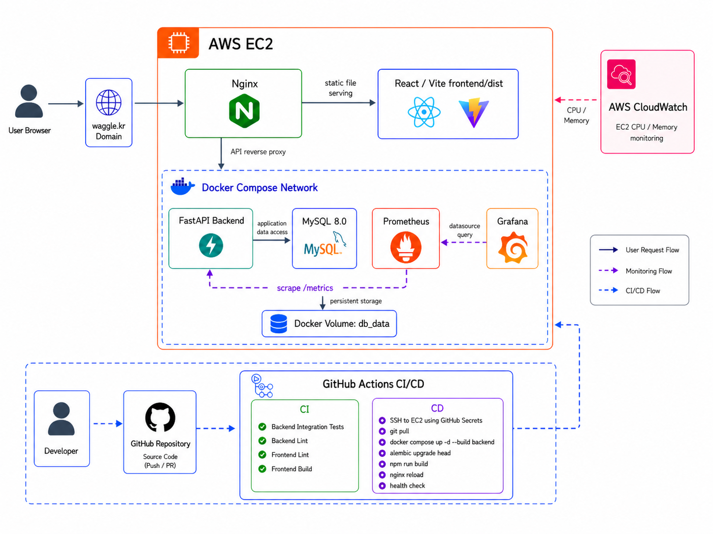

# Waggle

### 투표 기반 커뮤니티 서비스

Waggle은 다양한 주제에 대해 투표하고 댓글로 의견을 나눌 수 있는 커뮤니티 서비스입니다.  
사용자는 토픽을 만들고, 두 가지 선택지 중 하나에 투표하며, 댓글과 답글로 의견을 이어갈 수 있습니다.

- 서비스: [https://www.waggle.kr](https://www.waggle.kr)
- GitHub: [https://github.com/SECHANG1412/Waggle-Service](https://github.com/SECHANG1412/Waggle-Service)


## 목차

1. [프로젝트 개요](#프로젝트-개요)
2. [핵심 기능](#핵심-기능)
3. [기술 스택](#기술-스택)
4. [시스템 아키텍처](#시스템-아키텍처)
5. [주요 개선 사항](#주요-개선-사항)
6. [실행 방법](#실행-방법)
7. [테스트](#테스트)
8. [향후 개선 계획](#향후-개선-계획)
<br>

## 프로젝트 개요

- **목적**: 투표와 댓글을 중심으로 사용자들이 다양한 주제에 대해 의견을 나눌 수 있는 커뮤니티 제공
- **진행 기간**: 2025.11 ~ 진행 중
- **프로젝트 형태**: 개인 프로젝트
- **주요 특징**: 토픽 생성, 2지선다 투표, 투표 트렌드 차트, 댓글/답글, 프로필, 문의, 관리자 운영 기능
<br>

## 핵심 기능

### 1. 토픽 목록 및 투표 카드

- 카테고리별 토픽 목록 조회
- 검색어 기반 토픽 탐색
- 토픽 카드에서 투표 선택지와 현재 투표 비율 확인
- PC/모바일 화면에 맞춘 반응형 카드 구성

#### [PC 화면]
<p>
  
</p>


#### [모바일 화면]
<p>
  
</p>


### 2. 토픽 상세 및 투표 트렌드

- 토픽 상세 내용 확인
- 찬성/반대 투표
- 시간대별 투표 비율 차트 제공
- 댓글과 답글을 통한 의견 교환

#### [PC 화면]
<p>
  
</p>


#### [모바일 화면]
<p>
  
</p>


### 3. 토픽 생성

- 제목, 설명, 카테고리 입력
- 투표 선택지는 서비스 정책에 맞게 2개로 제한
- 사용자가 쉽게 토픽을 작성할 수 있도록 입력 흐름 구성




### 4. 프로필 및 사용자 활동

- 계정 정보 확인
- 사용자가 작성한 토픽과 댓글 확인
- 문의 처리 결과 확인




### 5. 관리자 운영 시스템

- 문의 처리 현황 확인
- 토픽/댓글 관리
- 관리자 조치 기록 확인
- 감사 로그를 통해 조치 대상과 사유 추적




<br>

## 기술 스택

### Frontend


### Backend


### Infra / DevOps / Monitoring


<br>
<br>

## 시스템 아키텍처


<br>


## 주요 개선 사항

### 1. 목록 조회 API 성능 개선

`/topics` 목록 조회에서 댓글 수, 답글 수, 투표 결과, 좋아요 수, pinned 여부를 topic별로 반복 조회하거나 계산하는 흐름이 있었습니다. 토픽 수가 늘어날수록 응답 생성 비용도 함께 증가할 수 있어, `topic_id` 기준 일괄 집계 구조로 개선했습니다.

- 댓글 수, 투표 결과, 좋아요 수를 `topic_id` 기준으로 한 번에 집계
- pinned 목록은 한 번 조회한 뒤 set/map으로 재사용
- 사용자별 상태값은 개인화 데이터로 분리
- k6 기준 300 VU / 5분 조건에서 처리량 약 37 req/s -> 약 95 req/s로 개선
- Redis 캐시도 고려했지만, 데이터 변경 빈도와 캐시 무효화 복잡도를 고려해 DB 조회 구조 개선을 우선 적용

### 2. 관리자 운영 시스템

사용자 문의, 콘텐츠 관리, 관리자 조치 기록을 하나의 운영 흐름으로 관리할 수 있도록 관리자 기능을 구성했습니다.

- `/contact`에서 로그인 사용자 기준 문의 접수
- 문의 상태를 미처리, 처리중, 완료로 관리
- 관리자가 부적절한 토픽/댓글을 삭제 처리
- 삭제 전 주요 정보를 감사 로그에 스냅샷으로 저장
- 관리자 조치의 대상과 사유를 감사 로그로 추적

### 3. CI/CD 및 운영 검증 자동화

GitHub Actions를 통해 PR 단계의 검증과 main merge 이후 배포 흐름을 자동화했습니다.

- PR 단계에서 backend test/lint, frontend lint/build 실행
- main merge 이후 EC2 배포 자동화
- Alembic migration, frontend build, Nginx reload, health check 실행
- `/health`, `/health/db`, `/topics`로 배포 후 상태 확인
- 운영 중 발생한 `/topics` 간헐적 500 오류를 EC2 로그로 추적하고 DB 커넥션 풀 설정 보완
<br>

## 실행 방법

### 1. 프로젝트 클론

```bash
git clone https://github.com/SECHANG1412/Waggle-Service.git
cd Waggle-Service
```

### 2. 환경 변수 설정

```bash
cp backend/.env.example backend/.env.local
cp frontend/.env.example frontend/.env.local
```

필요한 값은 각 환경에 맞게 수정합니다.

### 3. Docker Compose 실행

```bash
docker compose up -d --build
```

실행 후 기본 접속 주소:

- Frontend: `http://localhost:3000`
- Backend: `http://localhost:8000`
- Swagger UI: `http://localhost:8000/docs`
- MySQL: `localhost:3307`
- Prometheus: `http://localhost:9090`
- Grafana: `http://localhost:3001`

### 4. DB 마이그레이션

```bash
docker compose exec backend alembic upgrade head
docker compose restart backend
```

### 5. 로컬 개발 서버 실행

Frontend:

```bash
cd frontend
npm install
npm run dev
```

Backend:

```bash
cd backend
pip install -r requirements.txt
uvicorn main:app --reload
```
<br>


## 테스트

### Backend

```bash
cd backend
pytest -q tests/integration
```

### Frontend

```bash
cd frontend
npm run lint
npm run build
```

### k6 부하 테스트

```bash
k6 run k6/topics-list-smoke.js
```
<br>

## 향후 개선 계획

- 이메일 인증 및 비밀번호 재설정 흐름 추가
- 신고 기반 콘텐츠 관리 흐름 추가
- 검색/랭킹 기능 개선
- 성능 테스트 시나리오와 운영 지표 기록 보강
